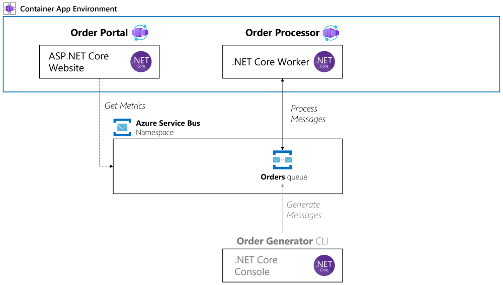

# Azure Container Apps Demos - .NET Core worker processing Azure Service Bus Queue

This application is a .NET Core Worker that is processing an Azure Service Bus queue and provides an ASP.NET Core Web application to visualize the queue depth.



This is a port of [Kubernetes Event-driven Autoscaling's (KEDA) '.NET Core worker processing Azure Service Bus Queue' sample](https://github.com/kedacore/sample-dotnet-worker-servicebus-queue).

## Deploy

Before you deploy, make sure to configure the required information in `deploy/service-bus-queue.parameters.json`

To deploy the scenario, run the following command to deploy the ARM template:

```cli
az deployment group create -n service-bus-queue -g $RESOURCE_GROUP_NAME --template-file deploy/service-bus-queue.template.json --parameters deploy/service-bus-queue.parameters.json
```

It will automatically create the Azure Service Bus namespaces with an orders queue which is being processed by the .NET Worker. The ASP.NET Core website will be deployed to the same resource group and visualize the information related to the pending messages to be processed.

## Test it out

The official KEDA sample provides a message generator that sends messages to the queue, feel free to learn more about it on [GitHub](https://github.com/kedacore/sample-dotnet-worker-servicebus-queue/blob/main/connection-string-scenario.md#publishing-messages-to-the-queue).

## Delete the application

Run the following command to delete the application:

```cli
az containerapp delete -g "$RESOURCE_GROUP_NAME" --name "$CONTAINER_WORKER_APP_NAME"
az containerapp delete -g "$RESOURCE_GROUP_NAME" --name "$CONTAINER_PORTAL_APP_NAME"
```
